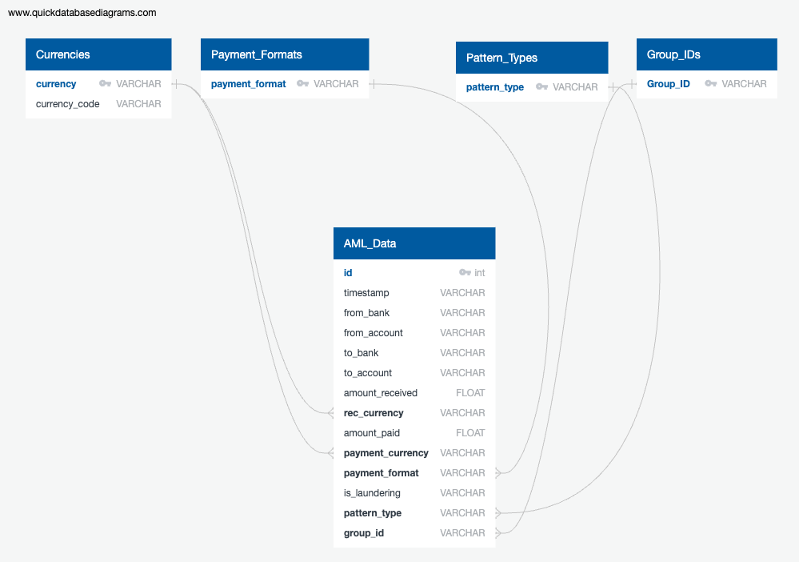

# Team Epsilon
IBM Anti-Money-Laundering Project

## Contributors
- Nathon Burwick
- Toyin Olaye
- Cole Valentyn
- Ariel Richardson
- Talita Urzeda
- Taylor Gibson

## GitHub Link
[GitHub](https://github.com/nburwick/ETL_Epsilon.git)

## Resources
[Kaggle link](https://www.kaggle.com/datasets/ealtman2019/ibm-transactions-for-anti-money-laundering-aml)
- HI-Large_Patterns.txt
- HI-Medium_Patterns.txt
- HI-Small_Patterns.txt
- LI-Large_Patterns.txt
- LI-Medium_Patterns.txt
- LI-Small_Patterns.txt

## Overview
Our team selected to use a dataset from Kaggle titled IBM Transactions for Anti Money Laundering. We elected to use the .txt files because we found the.csv was too large to push through GitHub. The txt file is comma delineated so we will convert it to a data frame. We will use MongoDB to build our database.

## Databases Created
- SQLite
- MongoDB

## Language Used
Jupyter Notebook

## Relationships
